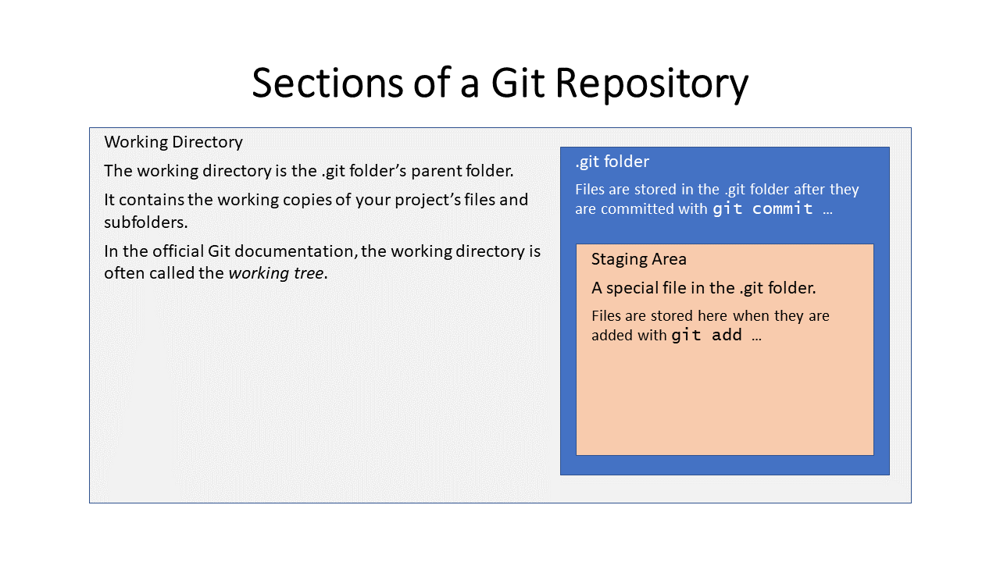
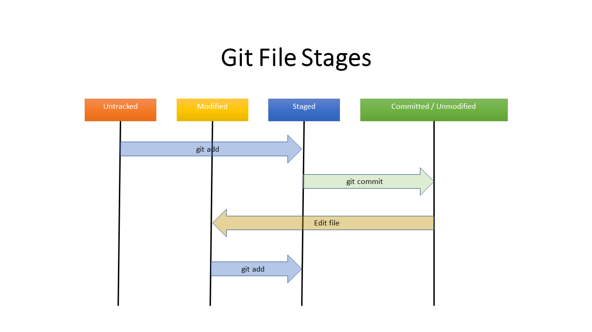

---
editor_options:
  markdown:
    wrap: 80
output:
  html_document:
    df_print: paged
---

# Understanding Git

The purpose of this document is to help the Issaquah Robotics Society's (IRS)
Python programmers use and understand the Git version control system (VCS). Git
is an essential tool for all software developers. Understanding how Git works
will help you avoid common problems and work more effectively with your team.

This document supplements an outstanding book by Scott Chacon and Ben Straub,
[*Pro Git*](https://git-scm.com/book/en/v2). It's available for free online and
is often referred to as "the Git book." *Pro Git* is comprehensive and its
explanations are excellent. But it can be intimidating for new programmers. This
document will summarize key concepts, point readers to essential portions of
*Pro Git*, and provide activities that will help readers internalize important
concepts.

## I. Getting Started

### Prerequisites

This tutorial assumes three things.

1.  You can use Windows Powershell or Mac Terminal.
2.  You know enough Python to import a package and write a simple function.
3.  You have installed and can use VS Code.

### Installing Git

Skip this section if Git is already installed on your system.

The IRS analytics group uses VS Code. We recommend that you install VS Code
before installing Git. You can [download VS Code from
here.](https://code.visualstudio.com/download)

Git is easy to install. Download the most recent version of Git for your
operating system from the [official Git download
site](https://git-scm.com/downloads). Run the installer. Accept all but two of
the default installation options:

1.  The installer might ask if you want to change the default branch name from
    "master" to "main". Select "main" as the default branch name.
2.  At some point the installer will ask which editor should be your default
    editor. The IRS recommends you select Microsoft VS Code. Keep the defaults
    for all other installation options.

### Configuring Git

If you are using Git for the first time, enter the following commands with your
own name and email address, so Git knows who you are:

```{bash}
git config --global user.name "John Doe"
git config --global user.email johndoe@example.com
```

If you already installed Git but you did not select VS Code as your editor, no
worries. You can configure Git to use VS Code with the following command:

``` bash
git config --global core.editor "code --wait"
```

If you are not sure what your default branch name is, you can see the default
name with this command:

``` bash
git config --global init.defaultBranch
```

You can change your default branch name with this command:

``` bash
git config --global init.defaultBranch main
```

### What is Git?

Git is a distributed version control system. That answer doesn't help if you
don't know what a version control system (VCS) is, so I'll explain with an
example.

Have you ever worked on a long report, like a term paper or a thesis? You
probably made many revisions to the document. Perhaps you occasionally saved a
copy of the document with a different file name? Perhaps you appended the date
to each file name? And maybe you saved the copies to a folder named *backups*?
if you did all that, then you created your own version control system. If you
decided you didn't like the changes you just made to your document, you could
pull the most recent version from your *backups* folder, rename it, and start
over.

Computer programmers frequently use version control systems. Programmers need
the ability to retrieve an older version of a code file if a recent change isn't
working out. They could use a manual process like we described in the previous
paragraph, but that would be tedious and error-prone. Manually renaming and
copying files is not fun, and it's easy to inadvertently write over an older
version. Fortunately, we have version control systems, like Git, that automate
these tasks.

With Git, you can easily save a snapshot of all the files in your project by
typing a couple commands. Git allows you to revert your project to any of these
earlier snapshot. But Git can do more than that. You can share code with other
developers (usually through Github) and Git will notify you if you and another
developer try to modify the same code. These features make Git an indispensable
tool.

-   Optional Reading: [Git Book 1.1: Getting Started - About Version
    Control](https://git-scm.com/book/en/v2/Getting-Started-About-Version-Control)
-   Optional Video: [Git Basics: What is Version
    Control?](https://git-scm.com/video/what-is-version-control)

### The FrcMath Project

To learn Git, we're going to build our own library of math functions, called
`frcmath`. It's important that you follow along by executing all git commands
contained in this document - you won't fully understand or retain the material
if you don't.

Key instructions will have a bold **Instructions!** label. Run these commands in
an Anaconda Prompt, Powershell window, or Mac Terminal. Don't skip any or you
won't be able to do the exercises.

### Getting Help

## 2. Basic Git Operations

### Forget About Github (for Now)

Please set aside (for now) any questions you have about Github. Github is a
valuable collaboration tool that is designed to work with Git. But we're
currently focusing on running Git on your local computer. We'll discuss Github
later.

### Create a Git Repository

**Instructions!**

1.  Create a folder named *frcmath* on your computer.
2.  Open a terminal and go to your *frcmath* folder.
3.  Create a new git repository in the *frcmath* folder by entering:

``` bash
git init
```

Verify that your repository was created by entering:

``` bash
git status
```

You should see something like this:

```         
    On branch main

    No commits yet

    nothing to commit (create/copy files and use "git add" to track)
```

You will see many references to "branch main" as you work through this document.
We'll cover branches later. Ignore branches for now.

#### The *.git* Folder

Run the `ls` command in the *frcmath* folder to see what the `git init` command
just did. The `ls` command should have returned nothing, indicating that the
*frcmath* folder is empty. But before we conclude that `git init` didn't do
anything, try running `ls` with the option to view hidden files (`ls -h` on
Windows or `ls -a` on Mac). You should see something like this:

```         
    Mode                 LastWriteTime         Length Name
    ----                 -------------         ------ ----
    d--h-l        11/13/2022  11:41 AM                .git
```

Git created a hidden folder named *.git* where it stores all information about
your git repository. The *.git* folder is self-contained, so you can make a copy
of a Git repo by copying the *.git* folder to a new location. (FYI, the term
*repo* is short for *repository*.)

> **Note:** The Git output examples are all from Windows Powershell. The output
> will look slightly different if you are using MacOS or Linux.

### Our First Commit

**Instructions!**

1.  Create a file in the *frcmath* folder. Name it *\_\_init\_\_.py*. Don't put
    any text in the file (leave it empty).
2.  Enter the command `git status` in your terminal.

You should see this output

```         
    On branch main

    No commits yet

    Untracked files:
      (use "git add <file>..." to include in what will be committed)
            __init__.py

    nothing added to commit but untracked files present (use "git add" to track)
```

Git was able to detect that we created a new file in the *frcmath* folder. But
since we didn't tell Git about the file, Git isn't tracking it. Git literally
told us that the file is "Untracked".

**Instructions!**

Enter this command:

``` bash
git add __init__.py
```

Run `git status`.

Do you see the changes? The `git add __init__.py` command told Git that it needs
to pay attention to the *\_\_init\_\_.py* file. The file is no longer untracked.
But it's not saved in the our Git repo either. It's status is now *staged*, or
waiting to be committed to the Git repository. Let's save *\_\_init\_\_.py* to
our repository.

**Instructions!**

Enter this command:

``` bash
git commit -m "Initial Commit"
```

> If you see a message like "Author Identity Unknown...", then configure Git
> with your username and email per the first part of the *Git Configuration*
> section of this document (or just follow the instructions in the Git output).

The value after the `-m` option is the commit message. The commit message can be
anything, but it should be a concise description of the changes we're making to
the code.

The output from`git commit` should look like this:

```         
    [main (root-commit) f0b8fe0] Initial Commit
     1 file changed, 0 insertions(+), 0 deletions(-)
     create mode 100644 __init__.py
```

Git is telling us, among other things, that we added one file to the commit.

You'll see the following output if you run `git status`.

```         
    On branch main
    nothing to commit, working tree clean
```

This message means that everything we did is stored in the Git repo (somewhere
in the *.git* folder). Git did not detect any new edits.

#### What Did We Just Do?

We just staged a file and then saved it to our Git repo. As long as we don't
delete the *.git* folder, we will always have this version of the
*\_\_init\_\_.py* file. It doesn't matter if we delete the file or change its
contents later -- we will always be able to retrieve this version.

Saving a file to the repo is a two step process.

-   First, we used the `git add ...` command to tell Git that we wanted to save
    *\_\_init\_\_.py*. This step is often called *staging.* The `add` command is
    easily reversible. If we changed our mind, we could unstage
    *\_\_init\_\_.py* with `git reset __init__.py`. Furthermore, we can call the
    `add` command as many times as we want and stage multiple files and folders.
-   Secondly, we saved *\_\_init\_\_.py* to the repo with the `git commit ...`
    command. The `git commit` command is only called once for each commit.
    Committing *\_\_init\_\_.py* means that it is persistently saved in our
    repo.

## 3. Git Concepts

### The Three Sections of a Git Repository

A Git repository has three main sections:

1.  **Working Directory:** The working directory is the *frcmath* directory and
    its subfolders (except for the *.git* folder). It's what you see if you look
    at the contents of the *frcmath* folder in Windows File Explorer or Mac
    Finder. It contains the current working copy of the project -- all of the
    files that we are currently working on. The working directory is also called
    the *working tree*.

2.  **Staging Area:** The staging area is a file in the *.git* folder. It
    contains information about all the files that will go into the next commit.
    In technical Git documentation, the staging area is called the index.

3.  **.git Directory:** The *.git* directory contains a database with all of the
    information for our project. Whenever we commit a file, the file's contents
    are stored in this database.



### File States

At any one time, a file in your repository can be in one of four states:

1.  **Untracked:** The *frcmath.py* file was in an untracked state when we first
    added it to the repo. File's are untracked if they are in the working
    directory but don't exist in the *.git* folder (i.e., the file was never
    committed) and have not yet been staged.

2.  **Staged:** Files become staged once we *add* them to the staging area with
    the `git add...` command. We moved *frcmath.py* from untracked to staged
    when we ran `git add`.

3.  **Committed and Unmodified:** A file moves from the staged state to the
    committed state once we run `git commit ...`. When we commit a file, the
    contents of the file are stored in the *.git* folder.

4.  **Modified:** A file is modified when it exists in the repo (i.e., in the
    *.git* folder) but the copy in the working directory is different than the
    repo copy. Adding any text to the *\_\_init\_\_.py* file would change it to
    a modified state.



## 4. Reverting to a Prior Commit

### Our Second Commit

**Instructions!**

1.  Create a file named *basic.py* in the *frcmath* folder.
2.  Add the following text to the file:

``` python
import math

def add(x, y):
    return x + y
```

3.  Add and commit the *basic.py* file to your repo. Give the commit a brief but
    descriptive commit message.

### Viewing the Repo's History

Run the command `git log --all`.

Your output should look similar to this:

```         
    commit 177378db5755a2239db04a3bfecba71c7799e8d4 (HEAD -> main)
    Author: mhamilton <margaret.hamilton@team1318.com>
    Date:   Sun Nov 13 17:09:03 2022 -0800

        Added addition function.

    commit f0b8fe019c566620c8b42b5453437889325f80e7
    Author: mhamilton <margaret.hamilton@team1318.com>
    Date:   Sun Nov 13 12:24:24 2022 -0800

        Initial Commit
```

The `git log` command lists the commits that have been made to the repository,
starting with the most recent commit. For each commit, `git log` shows the
following:

-   The commit's ID number, a 40-digit hexadecimal number that is often called
    the commit's hash.
-   The commit's author
-   The date and time of the change.
-   The commit message.

The log also provides information on your working directory. The *HEAD*
identifier appears next to the commit that is currently checked out into your
working directory.

### Checkout the Prior Commit

**Instructions!**

1.  List the contents of the *frcmath* folder with the `ls` command. You should
    see both the *\_\_init\_\_.py* and *basic.py* files.
2.  Run the following command, but replace `<hash>` with the first few
    characters from the first commit's hash (the non-*HEAD* commit).

``` bash
git checkout <hash>
```

Now list the *frcmath* folder's contents again. You should only see the
*\_\_init\_\_.py* file. The *basic.py* file should have disappeared. The
`git checkout` command returned your working directory to the exact state it was
in after the first commit.

Another way to see this change is to run `git log --all` again. The output
should look like this:

```         
    commit 177378db5755a2239db04a3bfecba71c7799e8d4 (main)
    Author: mhamilton <margaret.hamilton@team1318.com>
    Date:   Sun Nov 13 17:09:03 2022 -0800

        Added addition function.

    commit f0b8fe019c566620c8b42b5453437889325f80e7 (HEAD)
    Author: mhamilton <margaret.hamilton@team1318.com>
    Date:   Sun Nov 13 12:24:24 2022 -0800

        Initial Commit
```

The *HEAD* identifier has moved to the first commit.

### Restore the Latest Commit

**Instructions!**

1.  Run `git checkout <hash>` again to checkout the latest commit. Replace
    `<hash>` with the first few characters from the second commit's hash value.
    Make sure you use the hash value displayed on *your* computer, not the
    example hash in this document.
2.  Run `git log --all` again to verify that *HEAD* has moved back to the second
    commit. Then list the files in *frcmath* to verify that the *basic.py* file
    has reappeared.

### Supplemental Material

-   Optional Video: Git Basics: Get Going with Git
-   Optional Reading: [Pro Git Section2.2 - Recording Changes to the
    Repository](https://git-scm.com/book/en/v2/Git-Basics-Recording-Changes-to-the-Repository)

## 5. Git Internals (Advanced)

### A. Git Hash Values

Hopefully you notice that each commit was labeled with a 40-digit
[hexadecimal](https://en.wikipedia.org/wiki/Hexadecimal) number. This number is
called a hash value, or hash. Hash values are produced by special algorithms,
called hash algorithms, that can convert data of arbitrary length to a fixed
length value.

When we commit files to a repo with Git, Git submits all of the changed files to
a hash algorithm called SHA-1 (SHA stands for secure hash algorithm). Git also
submits the commit message, commit author, and the date and time of the commit
to SHA-1. The resulting hash is used as a label that identifies the specific
commit.

Git uses the SHA-1 hash for two reasons.

1.  SHA-1 has 1.46 x 10\^48 possible hash values. It is extremely, extremely
    unlikely that two different commits will have the same hash.
2.  Any change to the commit's data, even small changes, will result in big
    changes to the hash value generated by SHA-1.

The SHA-1 algorithm isn't used just to generate commit labels. As suggested by
reason #2, the SHA-1 hashes are used to verify data integrity. If someone tried
to change a few bytes of data inside a Git repo, we would be able to detect the
change because the commit's hash value would change.

There are several Git commands that accept hash values as parameters (like
`git checkout ...`). Fortunately Git does not require us to type the entire
40-digit hash. Git commands will work fine if with just the first few
characters, as long as the repo doesn't contain any other hash that starts with
the same characters.

This section contains detailed information on how Git works internally.
Understanding this material will help you use Git effectively (and it's
interesting), but it's not necessary for basic Git operations.

### B. The *.git* Folder.

Let's look at the contents of the *.git* folder. Run `ls .git` (Windows) or
`ls .git -l` (Mac, Linux) from the *frcmath* folder. You should see something
like this:

```         
    Mode                 LastWriteTime         Length Name
    ----                 -------------         ------ ----
    d----l        11/13/2022   8:23 AM                hooks
    d----l        11/13/2022   8:23 AM                info
    da---l        11/13/2022  12:24 PM                logs
    d----l        11/13/2022   5:09 PM                objects
    d----l        11/13/2022   8:23 AM                refs
    -a---l        11/13/2022   8:23 AM            130 config
    -a---l        11/13/2022   8:23 AM             73 description
    -a----        11/14/2022   6:57 PM             21 HEAD
    -a----        11/14/2022   6:57 PM            217 index
```

The *.git* folder contains several files and subfolders.

#### Files

Four of the files are just text files. You can view the contents of these files
by typing `cat <filename>`. Go ahead and take a look.

-   The *config* file contains configuration settings that are specific to the
    *frcmath* repository. Any settings specified with the
    `git config     --local` option will be stored in this file.
-   The *description* file isn't used when we run Git from the command line
    (it's used by a tool called
    [GitWeb](https://git-scm.com/book/en/v2/Git-on-the-Server-GitWeb)).
-   The *COMMIT_EDITMSG* contains the message from the most recent commit.
-   The *HEAD* file tracks which commit is checked out to the working directory.

The *index* file is a binary file that tracks the items that have been staged
for commit. The *HEAD* and *index* files are important and we'll discuss them
later.

#### Folders

Three of the folders, *hooks*, *info*, and *logs*, are either for advanced
topics or are just not that interesting. They will not be discussed in this
document.

The remaining two folders are crucial.

-   the *refs* folder defines the branches and tags that are stored in the repo.
    We have not yet discussed branches and tags, but they are important.
-   The *objects* folder contains most of the data stored in the repository,
    including the contents of all committed files. We'll continue our discussion
    of Git's internals by analyzing the *object* folder's contents.

### C. Object Folder

Use the `ls` command to view the contents of the *.git/objects* folder. You
should see something like this:

``` plaintext
(pyclass) PS C:\Users\mhamilton\Projects\git\frcmath> ls .git/objects

    Directory: C:\Users\mhamilton\Projects\git\frcmath\.git\objects

Mode                 LastWriteTime         Length Name
----                 -------------         ------ ----
da---l        11/13/2022   5:09 PM                17
da---l        11/13/2022   5:09 PM                78
da---l        11/13/2022  12:24 PM                9d
da---l        11/13/2022   5:07 PM                c3
da---l        11/13/2022  12:18 PM                e6
da---l        11/13/2022  12:24 PM                f0
d----l        11/13/2022   8:23 AM                info
d----l        11/13/2022   8:23 AM                pack
```

The *objects* folder contains several subfolders with 2-character names. Use
`ls` to view the contents of the *c3* subfolder.

``` plaintext
Mode                 LastWriteTime         Length Name
----                 -------------         ------ ----
-ar--l        11/13/2022   5:07 PM             58 e6abbb510b6353c5b4d4ecbe25241df93a4b83
```

Interesting. The *c3* folder contains one file with a long, hexadecimal name.
There are 38 characters in the filename. If you combine those 38 characters with
the 2-character foldername, you get a 40-character hexadecimal number. Can you
guess what this 40-character number represents? It's a SHA-1 hash value.

We can't directly view the contents of the *c3/e6ab...* file because Git
compresses the files that are stored in the *.git/objects* folder. (Git uses
[zlib](https://zlib.net/) compression.) But we can use Git's `cat-file` command
to view the file's contents. Run the following command:

``` bash
git cat-file -p c3e6ab
```

The output should look like this:

``` python
    import math

    def add(x, y):
        return x + y
```

Excellent! We found where Git stored the contents of our *basic.py* file. The
*c3/e6ab...* folder and file name were created from *basic.py*'s hash value,
which was calculated by Git from the file's contents.

Git takes the following actions when we commit a file to the repo:

1.  Git calculates a SHA-1 hash from the file's contents.
2.  Git creates a subfolder in the *.git/objects* folder (if it doesn't already
    exist) and names the subfolder with the first two characters from the file's
    SHA-1 hash.

#### Questions?

There are two questions that I hope you're asking yourself right now.

1.  How does Git track filenames? The `.git/objects/c3/36...` file doesn't
    contain the filename *basic.py*.
2.  There are only two files in our repo, but it looks like there are at least
    six files in the *objects* subfolder. What are the other files for?

The answers to both questions are related. Let's use the `git cat-file` command
to figure this out.

Use `cat-file` to view the contents of the *78/7f file.* You should see the
following output. Don't forget the `-p` switch. Also remember that `cat-file`
requires the file's SHA-1 hash, not its path (so don't use a slash).

``` text
100644 blob e69de29bb2d1d6434b8b29ae775ad8c2e48c5391    __init__.py
100644 blob c3e6abbb510b6353c5b4d4ecbe25241df93a4b83    basic.py
```

We have the answer to our first question. For each file in the working directory
(the *frcmath* folder), the *78/7f* file contains the filename and the the SHA-1
hash. We can use the hash to display the contents of the file with the
`git cat-file` command and to locate the corresponding repository file within
the *.git/objects* folder. The *78/7f* file is a *tree* file. To see that for
yourself, run `git cat-file -t 787f`.

The *c3/e6* and *e6/9d* files are blob files. Blob stands for *binary large
object*. Blob files are used to represent files in the working directory. Run
\`git cat-file -t *e6/9d* to see this for yourself.

As you can see, the `git cat-file` command is a useful tool for seeing how your
git repo is structured. Use the `-p` option to display the contents of a file in
the *.git/objects* subfolder, and used the `-t` switch to view the file's type
(tree or blob).

There is one column in the tree file that we have not yet discussed. The number
*100644* is a numeric code that describes the permissions assigned to each file.
*100644* means we can read and write to the file, but the file itself is not
executable. These codes come from Linux. We will not go into more detail here,
but you can look up Linux's *chmod* command if you would like to learn more.

#### Commit files

There is one more type of file that can be stored in the *.git/objects* folder.
Unfortunately, the hash for this file will be different on different computers.
You'll have to find this file yourself. Run `git log` to get the hashes for both
commits. Then run `git cat-file -t ...` on both of these hashes. You will see
that these hashes both have type *commit*. Next, run `git cat-file -p ...` on
both of these files. You should see the following output.

##### File #1

``` plaintext
    tree 9d1dcfdaf1a6857c5f83dc27019c7600e1ffaff8
    author mhamilton <mhamilton@team1318.org 1668371064 -0800
    committer mhamilton <mhamilton@team1318.org 1668371064 -0800

    Initial Commit
```

##### File #2

``` plaintext
    tree 787f85a1d90e5267d96e3f7e351a5d22c09c1448
    parent f0b8fe019c566620c8b42b5453437889325f80e7
    author mhamilton <mhamilton@team1318.org 1668388143 -0800
    committer mhamilton <mhamilton@team1318.org 1668388143 -0800

    Added addition function.
```

Hopefully things are starting to make sense. We committed twice to the *frcmath*
repo and we have two commit files in the *.git/objects* folder. Each commit file
stores that commit's commit message, the date and time of the commit, the
commit's author, and the commit's owner (usually the same as the author).

In addition, both commits contain the hash for a tree file. The tree file
contains the names and hashs of all files that were commited from the *frcmath*
folder. Use the `cat-file` command on the tree hashes in both commit files to
convince yourself that this is true.

Finally, the file for the second commit ("Added addition function") has an
additional hash that's labeled "parent". A quick glance at the hash values will
show that this hash matches the hash for the first commit file ("Initial
Commit"). Remember, the hashes on your computer will be different than the
hashes in these examples. This tells us something about Git. Except for the
first commit, every commit has one (or more) parent commits.

#### Summary

We now know what all of the files in the *.git/objects* folder represent. There
are two commit files, one for each time that we committed files to the repo.
There are two tree files, one for each commit. Finally, there are two blob
files, one for each file we created in the working directory.

**Instructions!**

#### Exercise: Why Are There Only Two Blobs?

We staged one file for our first commit (*\_\_init\_\_.py*) and two files for
our second commit (*\_\_init\_\_.py* and *basic.py*). Shouldn't there be three
blob files in the *.git/objects* folder? Why are there only two? HINT: inspect
the hashes in each commit's tree file.

#### Exercise: Repo Graph

Draw a graph diagram that illustrates the contents of the *.git/objects* folder
and the relationships between the different files. Use pencil and paper or the
software of your choice. 1. Draw a circle and put the following things in the
circle:

-   "Initial Commit"
-   The first six digits of the initial commit's hash
-   "Tree: <tree-hash>" where <tree-hash> is the first six digits of thefirst
    commit's tree file.

2.  Draw an arrow to another circle. Put this stuff in the new circle:

-   "Working Tree"
-   The hash and filename for every entry in the first commit's working tree.

3.  Draw another arrow to yet another circle. You should have three circles by
    now. Include this info in the third circle:

-   "Commit: Added Addition function"
-   The first six digits of the second commit's hash
-   As in circle #1, add an entry for this commit's tree. Include the first six
    digits of the tree's hash.

Keep drawing arrows and new circles until all six files in the *.git/objects*
folder are represented on your graph (should have six circles). You will need to
add an arrow that originates from circle #2 (first commit's tree) and points to
a circle representing ***init**.py* from the first commit. You'll need to add
two circles that represent both files added to the second commit. Make sure you
include the file name and first portion of the hash for all circles that
represent blobs (i.e., files in the working directory).

When you are done, you will have drawn a directed acyclic graph that represents
the relationships between objects in our repository. Per graph terminology, the
circles are called nodes and the arrows are called edges.

#### Exercise: Duplicate Files

Suppose two files in the same folder that are exactly the same, but have
different file names. Both files contain the single line of text "Hello World!"
and are named *file1.txt* and *file2.txt*.

1.  Do the files have different hash values?

2.  How does Git know there are two different files with the exact same
    contents?

3.  Does the answer to questions 1 and 2 change if *file1.txt* and *file2.txt*
    are in different folders?

4.  Does the answer to questions 1 and 2 change if *file1.txt* and *file2.txt*
    were added to the repository in different commits?

5.  Create a Git repo that contains *file1.txt* and *file2.txt*. Experiment as
    needed to check your answers.
