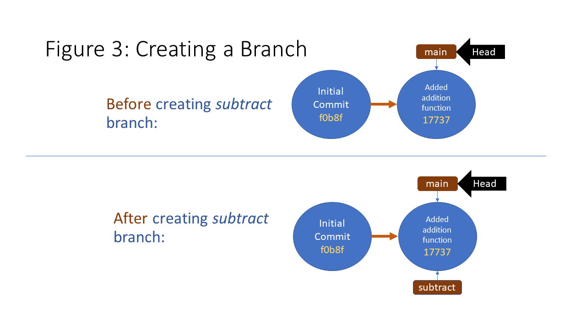
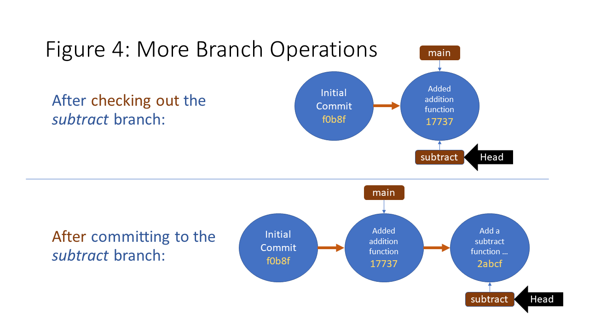
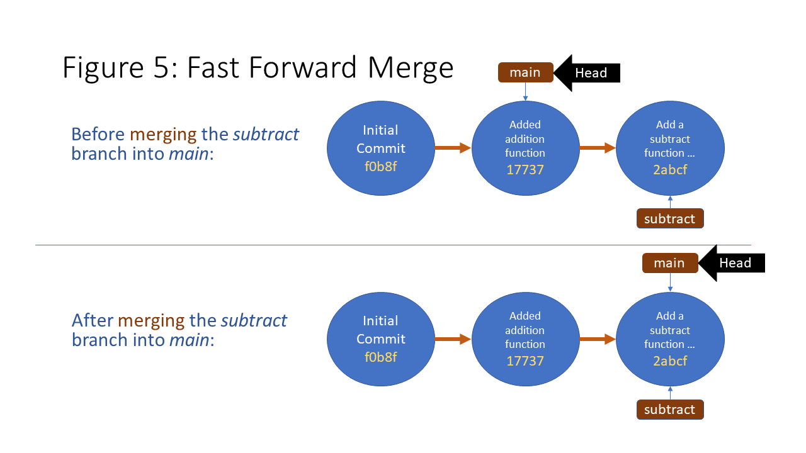
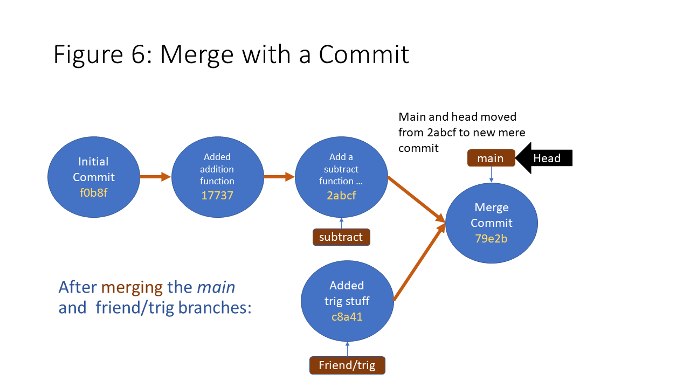

---
editor_options:
  markdown:
    wrap: 80
---

# Branches and Merging

Suppose you decided that the frcmath project is just too big for one person, and
that a friend agreed to help you write new functions. You both decide that you
will add a `subtract()` function to *basic.py* and your friend will add a new
Python module with trigonometric functions.

You make a *.zip* file with the contents of the *frcmath* folder and send it to
your friend so they can start coding.

**Instructions!**

1.  In *frcmath/basic.py*, add a `subtract()` function. Your *frcmath.py* file
    should look like this:

    ``` python
    """This module contains helpful math functions."""

    def add(x, y):
        return x + y

    def subtract(x, y):
      return x - y
    ```

    1.  Make a copy of your *frcmath* folder. Name it *friendmath*.

2.  Now pretend to be your friend. Switch over to the code in the *friendmath*
    folder.

3.  Create a new file named *trig.py* in the *friendmath* folder.

4.  Add the following text to *friendmath/trig.py.*

    ``` python
    """This module contains trignonometric functions."""
    import math

    def sin(theta):
        return math.sin(theta)

    def cos(theta):
      return math.cos(theta)
    ```

How will you combine your friend's code with yours? Your friend could send her
*trig.py* file to you, and then you could copy it into your *frcmath* folder.
And you could send the *basic.py* file to your friend so she can copy it into
her repository. That's not too hard to do in a simple situation like this. But
what if instead of two programmers there are five? And they are all adding
different features and finishing their work at different times? Manually
updating code files and repos like this would be complicated, tedious, and
error-prone.

Git has features that help in this situation. \* Git *branches* allow a Git repo
to contain multiple versions of a code file. \* Git *remotes* are used to
transfer code between different git repositories. \* The Git *merge* command
will merge different versions of a codebase into a single commit.

## The Main Branch

Our Git repo already contains one branch. Git creates a branch called *main* (or
sometimes it's called *master*) whenever we create a new Git repository. Run
`git status` in the *frcmath* repository to see your current branch.

```         
On branch main
Changes not staged for commit:
  (use "git add <file>..." to update what will be committed)
  (use "git restore <file>..." to discard changes in working directory)
        modified:   basic.py
```

The first line from `git status` informs us that we're currently on the *main*
branch. It also informs you that your *basic.py* file has changed.

A git repo can have multiple branches. We'll create more branches soon. But
first, we're going to learn about something called *HEAD*.

## What's this HEAD Thing About?

Earlier we found a *HEAD* file in the *.git* folder. And there was a reference
to something called HEAD in the output from the `git log` command back in
section 1 (see below). These two *HEAD*s are related.

```         
commit 177378db5755a2239db04a3bfecba71c7799e8d4 (HEAD -> main)
Author: mhamilton <margaret.hamilton@team1318.com>
Date:   Sun Nov 13 17:09:03 2022 -0800

    Added addition function.

commit f0b8fe019c566620c8b42b5453437889325f80e7
Author: mhamilton <margaret.hamilton@team1318.com>
Date:   Sun Nov 13 12:24:24 2022 -0800

    Initial Commit
```

> We recommend you follow along with these exercises, running each command on
> your own computer and checking the results. Note that the commit hashes will
> be different on your computer than the examples here (because the hash
> algorith incorporates your user name and the time of the commit). **When
> running a command that includes a commit hash, use the hash code from your own
> computer, not the code in the example.**

Let's figure this out. The *.git/HEAD* file is a plain text file. Run
`cat .git/HEAD` from your repo's working directory to see its contents.

```         
ref: refs/heads/main
```

That's interesting. The contents of the *.git/HEAD* file look like a path to a
file or folder. There is a *.git/refs* folder, and we just learned that the repo
contains a branch called *main*. Run `ls .git/refs` to see what's in the *refs*
folder. You should see something like this:

```         
Mode                 LastWriteTime         Length Name
----                 -------------         ------ ----
d----l        11/13/2022   5:09 PM                heads
d----l        11/13/2022   8:23 AM                tags
```

There is a *heads* subfolder in *refs*! Let's run `ls .git/refs/heads`.

```         
Mode                 LastWriteTime         Length Name
----                 -------------         ------ ----
-a---l        11/13/2022   5:09 PM             41 main
```

It's clear now that the HEAD file contains a path. Currently this path refers to
the *.git/refs/heads/main* file. Run `cat .git/refs/heads/main` to see what's in
the *main* file.

```         
177378db5755a2239db04a3bfecba71c7799e8d4
```

The *main* file contains a SHA1 hash. Is it one of the hashes from the
*.git/objects* folder? Let's run `git cat-file -t 17737` to find out. The `-t`
option will tell us the type of object. (Remember, the hash will be different on
your computer.)

```         
commit
```

The 17737... hash refers to a commit. If you run `git log`, you'll see that the
17737... commit is labeled as the HEAD commit.

In summary, HEAD refers to the commit that is currently represented by our
working directory. In this case, the *.git/HEAD* file points to a file that has
the same name as our current branch, *.git/refs/heads/main*, and the
*.git/refs/heads/main* file points to the commit that is currently checked out.

## More About Branches

### Creating a New Branch

Now we'll create a new branch to contain our recent code changes.

**Instructions!**

Create a new Git branch named *subtract* with the command `git branch subtract`.
Git didn't display any output, so run `ls .git/refs/heads` to see what Git just
did.

```         
Mode                 LastWriteTime         Length Name
----                 -------------         ------ ----
-a---l        11/13/2022   5:09 PM             41 main
-a----        12/25/2022  12:28 PM             41 subtract
```

Do you see what changed? Git created a new file in the *.git/refs/heads* folder.
The file has the same name as the branch we just created: *subtract*. Run
`cat .git/refs/heads/subtract` to see what's in the *subtract* file.

```         
177378db5755a2239db04a3bfecba71c7799e8d4
```

Interesting. The *subtract* file contains the hash for the most recent commit,
just like the *main* file.

Now let's get a list of the branches that exist in our repo. It's easy, just run
`git branch`.

```         
* main
  subtract
```

The output from `git branch` indicates that we have two branches, one named
*main* and one named *subtract*. The asterisk next to *main* means that the
*main* branch is currently checked out. If you were to look at the content of
*.git/HEAD*, you wold see it hasn't changed.

### Checking out a Branch

**Instructions!**

Let's checkout the *subtract* branch. Run `git checkout subtract`. You should
see the following output:

```         
Switched to branch 'subtract'
M       basic.py
```

The output shows that we switched to the *subtract* branch and that the
*basic.py* file is still in modified status (i.e., it doesn't match the
*basic.py* file that's stored in the repo).

What exactly happened when we checked out the *subtract* branch? Maybe
`git status` will give us a clue. Run it to see what happens.

```         
On branch subtract
Changes not staged for commit:
  (use "git add <file>..." to update what will be committed)
  (use "git restore <file>..." to discard changes in working directory)
        modified:   basic.py
```

Except for being on branch *subtract*, the `git status` output looks exactly the
same. Inspecting the contents of the *frcmath* folder will show that nothing
changed in the working directory. All the files are exactly the same.

Something did change inside the repo. Run `cat .git/HEAD` to see what changed.

```         
ref: refs/heads/subtract
```

That's it. The only thing that changed when we checked out the branch is that
the HEAD file points to the *refs/heads/subtract* file instead of
*refs/heads/main*.

#### IMPORTANT: Checkout Behavior

The branch checkout behavior we just witnessed is a special case.

If you have un-committed changes in your working directory (like the changes we
made by added a subtract method to *basic.py*), checking out a branch that
points to a different commit would result in losing the un-committed changes.
Depending on the differences between the current and checked-out branch, working
directory files will be modified, removed, or added. Git normally protects you
from losing your changes by refusing to checkout a branch when there are
uncommitted changes in the working directory. (You can override this behavior
with the -f or --force option.)

But in this case, the *main* and *subtract* branches point to the same commit.
Git doesn't change the working directory when checking out a branch that points
to the same commit, so no warning is issued, the *.git/HEAD* file is updated to
point to the new branch, and the working directory is left unchanged.

### Branch Summary

In summary:

-   Creating a new branch creates a new file in *.git/refs/heads*. The new file
    has the same name as the new branch, and it contains the hash from the
    currently checked out commit.

-   Checking out a branch changes the content of the *.git/HEAD* file.

-   Checking out a new branch also changes the content of the working directory,
    unless both branches point to the same commit.

### Committing on a New Branch

**Instructions!**

Let's assume you are satisfied with your new `subtract()` function. Add the
*frcmath/basic.py* file and commit it. Make sure you are in the *frcmath* folder
(not the *friendmath* folder.)

Next, run `git log` form the *frcmath* folder. You should see something like
this:

```         
commit 2abcf799a9fe75f011e1e983df16db851b639959 (HEAD -> subtract)
Author: mhamilton <margaret.hamilton@team1318.com>
Date:   Tue Dec 27 20:02:39 2022 -0800

    Added a subtract function in basic.py

commit 177378db5755a2239db04a3bfecba71c7799e8d4 (main)
Author: mhamilton <margaret.hamilton@team1318.com>
Date:   Sun Nov 13 17:09:03 2022 -0800

    Added addition function.

commit f0b8fe019c566620c8b42b5453437889325f80e7
Author: mhamilton <margaret.hamilton@team1318.com>
Date:   Sun Nov 13 12:24:24 2022 -0800

    Initial Commit
```

The `git log` output is informative. The `(HEAD -> subtract)` phrase tells us
that our most recent commit was on the *subtract* branch and that it is
currently checked out. The `(main)` phrase after the second commit indicates
that the second commit is pointed to by the *main* branch.

We'll better understand what's going on if we look at some repository diagrams.



Figure 3 shows the state of the repo immediately before and after creating the
*subtract* branch. The blue circles are commits. The brown rectangles are
branches and the black arrow shows the what the HEAD pointer is pointing to. The
main takeaway is that both diagrams are nearly identical. Almost nothing happens
when we create a branch.

A branch is like a variable that points to a single commit. Creating a new
branch just creates a new variable that points to the commit that's currently
checked out. Another way to look at it is that we just copied the *main* branch
variable into a new variable named *subtract*. There were no changes to any of
our commits or to any files in our working directory.

Figure 4 shows how the repository changed when we checked out and committed the
*subtract* branch.



Checking out the *subtract* branch caused the HEAD pointer to move from the
*main* branch to the *subtract* branch. That's it. There were no changes to any
files in the working directly and there were no changes to the *.git/objects*
file.

Committing the updated *basic.py* file created a new commit object in the
*.git/objects* folder and caused the *subtract* branch to point to this new
commit. Note that the *main* branch didn't change at all. It still points to the
prior 17737 commit.

## Getting Code from Another Repository - Git Remotes

Let's make some changes to the code in the *friendmath* repo.

**Instructions!**

1.  Now pretend you are your friend. Go into the *friendmath* folder. Create a
    branch named *trig*.

2.  Check out the *trig* branch.

3.  Add the *friendmath/trig.py* file and commit.

Run `git log` from the *friendmath* folder. You should see something like this:

```         
commit c8a415f059875ed02753b261ba88ee7192511bcc (HEAD -> trig)
Author: vetaylor <valerie.e.taylor@team1318.com>
Date:   Tue Dec 27 19:54:01 2022 -0800

    Added sin and cos functions in trig.py

commit 177378db5755a2239db04a3bfecba71c7799e8d4 (main)
Author: mhamilton <margaret.hamilton@team1318.com>
Date:   Sun Nov 13 17:09:03 2022 -0800

    Added addition function.

commit f0b8fe019c566620c8b42b5453437889325f80e7
Author: mhamilton <margaret.hamilton@team1318.com>
Date:   Sun Nov 13 12:24:24 2022 -0800

    Initial Commit
```

### Creating a Remote

A *remote* is a link to another repository. We are going to create a remote in
the *frcmath* repository that links to the *friendmath* repository.

**Instructions!**

1.  Make sure the *frcmath* and *friendmath* folders are in the same parent
    folder.
2.  Make sure you are in the *frcmath* folder and run
    `git remote add friend ../friendmath`

The `git remote` command adds a link to another repository. These links are
called *remotes* and every remote has a name. We named our remote *friend*. We
also told our *frcmath* repo exactly how to reach the *friendmath* repo by
providing a relative path. The `git remote` command also accepts absolute paths
and internet URLs.

You can see a repo's remotes by running `git remote`. You can see the *friend*
remote's URL by running `git remote get-url friend` or `git remote -v`.

```         
PS C:\Users\mhamilton\Projects\frcmath> git remote
friend

PS C:\Users\mhamilton\Projects\frcmath> git remote get-url friend
../friendmath
```

Remotes are defined in the *.git/config* file. Run `cat .git/config` to see the
contents of the *config* file.

```         
PS C:\Users\mhamilton\Projects\frcmath>  cat .git/config
[core]
        repositoryformatversion = 0
        filemode = false
        bare = false
        logallrefupdates = true
        symlinks = false
        ignorecase = true
[remote "friend"]
        url = ../friendmath
        fetch = +refs/heads/*:refs/remotes/friend/*
```

The remote has its own section in the config file, where its URL and other
properties are defined.

### Fetching Code from a Remote Repository

Now that the *frcmath* repository knows how to connect to *friendmath*, let's
get the code changes from *friendmath*.

**Instructions!**

Run the command `git fetch friend` command.

```         
PS C:\Users\mhamilton\Projects\frcmath> git fetch friend
From ../friendmath
 * [new branch]      main       -> friend/main
 * [new branch]      trig       -> friend/trig
```

The `git fetch` command connected to the *friendmath* git repository and pulled
the data from *friendmath* that did not already exist in *frcmath*. The `fetch`
command determined that *friendmath* contains two branches, *main* and *trig*.

Run `git log –all` to better understand what the `fetch` command did.

```         
(pyclass) PS C:\Users\mhamilton\frcmath> git log --all
commit 2abcf799a9fe75f011e1e983df16db851b639959 (subtract)
Author: mhamilton <margaret.hamilton@team1318.com>
Date:   Tue Dec 27 20:02:39 2022 -0800

    Added a subtract function in basic.py

commit c8a415f059875ed02753b261ba88ee7192511bcc (friend/trig)
Author: mhamilton <margaret.hamilton@team1318.com>
Date:   Tue Dec 27 19:54:01 2022 -0800

    Added sin and cos functions in trig.py

commit 177378db5755a2239db04a3bfecba71c7799e8d4 (HEAD -> main, friend/main)
Author: mhamilton <margaret.hamilton@team1318.com>
Date:   Sun Nov 13 17:09:03 2022 -0800

    Added addition function.

commit f0b8fe019c566620c8b42b5453437889325f80e7
Author: mhamilton <margaret.hamilton@team1318.com>
Date:   Sun Nov 13 12:24:24 2022 -0800

    Initial Commit
```

Following the fetch operation, the *frcmath* repo contains four commits.

1.  The initial commit: f0b8f.
2.  The most recent commit on the *main* branch: 17737.
    -   The *HEAD* label indicates this commit is checked out to the working
        directory.

    -   This is also the most recent commit for a branch called *friend/main*.
3.  The most recent commit for a branch called *friend/trig*: c8a41
4.  The most recent commit for the *subtract* branch: 2abc4

The *friend/main* and *friend/trig* branches did not exist in the *frcmath* repo
prior to the fetch operation. These are *remote tracking branches* that were
created by Git to mirror branches from the *friendmath* repository.

Remote tracking branches are defined in the *.git/refs/remotes* folder, not the
*.git/refs/heads* folder that is used to track local branches. Run
`ls .git/refs/remotes` to see for yourself.

```         
Directory: C:\Users\mhamilton\Projects\frcmath\.git\refs\remotes


Mode                 LastWriteTime         Length Name
----                 -------------         ------ ----
da---l        12/31/2022   9:52 AM                friend
```

The *.git/refs/remotes* folder contains a subfolder for each remote that has
been added to the repo. Run `ls .git/refs/remotes/friend` to see the contents of
the *friend* subfolder.

```         
Directory: C:\Users\mhamilton\Projects\frcmath\.git\refs\remotes\friend


Mode                 LastWriteTime         Length Name
----                 -------------         ------ ----
-a---l        12/31/2022   9:52 AM             41 main
-a---l        12/31/2022   9:52 AM             41 trig
```

The *friend* folder contains a file for each remote tracking branch.

You can checkout remote tracking branches and merge them with local branches.
But you generally don't commit to remote branches or otherwise change them. Git
will manage the remote tracking branches for you.

The log showed one commit, c8a41, that is attached to a remote tracking branch
but is not connected to any local branches. The contents of this commit were
copied to the local *frcmath* repo by the fetch operation. Run
`git cat-file -p c8a41` to prove this to yourself.

```         
PS C:\Users\mhamilton\Projects\frcmath> git checkout trig
Switched to a new branch 'trig'
branch 'trig' set up to track 'friend/trig'.
```

3.  Run `ls` and verify that the *trig.py* file is in the working directory.

### Merging From a Local Branch

Verify you are on the *main* branch and run `cat basic.py` to review the
contents of this module. Now checkout the *subtract* branch and review the
content of *basic.py* again. The *subtract* version has a `subtract()` function,
but the *main* version does not. We would like to get the `subtract()` function
into the *main* branch's version of *subtract.py*. This is a job for Git's
*merge* command.

**Instructions!**

1.  Checkout the *main* branch
2.  Run `git merge subtract`

You should see something like this.

```         
Updating 177378d..2abcf79
Fast-forward
 basic.py | 5 ++++-
 1 file changed, 4 insertions(+), 1 deletion(-)
(irs24) PS C:\Users\stacy\OneDrive\Projects\Python_Training\git\frcmath>
```

The *merge* command compared the *subtract* to the *main* branch to identify all
the differences between the two branches. In this example, the only difference
was that the *subtract* branch's *basic.py* file contained an extra function.

Git also figured out that the *main* branch's commit (17737) is a direct
ancestor of the *subtract* branch's commit (2abcf). Git did a fast-forward merge
which means Git moved the *main* branch to point to the *subtract* branch's
commit. Run `git log --parents --oneline` to see this for yourself.

```         
2abcf79 177378d (HEAD -> main, subtract) Added a subtract function in basic.py
177378d f0b8fe0 (friend/main) Added addition function.
f0b8fe0 Initial Commit
```

We used the `--oneline` option to condense each log entry into one line and the
`--parent` option to show each commit's parent. For example, in the first line,
the commit has is 2abcf79 and that commit's parent is 177378d.

The output indicates that both the *main* and *subtract* branches now point to
the same commit (2abcf). No changes were made to the *friend/main* remote
tracking branch, which still points to commit 17737, which was pointed to by the
*main* branch prior to the merge. See figure 5 for a graphical explanation.



### Merging from a Remote Branch

Next, we need to get our friend's *trig.py* module into the main branch.

**Instructions!**

1.  Make sure you are still on the *main* branch in the *frcmath* repo.
2.  Run `git merge friend/trig.`

You should see something like this:

```         
PS C:\Users\mhamilton\Projects\frcmath> git merge friend/trig
Merge made by the 'ort' strategy.
 trig.py | 8 ++++++++
 1 file changed, 8 insertions(+)
 create mode 100644 trig.py
```

Git reports that it added the *trig.py* file and there don't appear to be any
problems. Run `git log --oneline --parents` to see exactly what happened.

```         
79e2b78 2abcf79 c8a415f (HEAD -> main) Merge remote-tracking branch 'friend/trig'
2abcf79 177378d (subtract) Added a subtract function in basic.py
c8a415f 177378d (friend/trig) Added sin and cos functions in trig.py
177378d f0b8fe0 (friend/main) Added addition function.
f0b8fe0 Initial Commit
```

Figure 6 graphically describes the merge.



Unlike the prior merge, this merge made a new commit (79e2b78). Merge commits
have two parents. We can tell from the parent hash codes that the merge commit
was constructed by combining commit 2abcf79 (*main* branch prior to the merge)
and the *friend/trig* branch (c8a415f). Git can usually decide what type of
merge to conduct on its own.

## Summary

We have learned about many of Git's major features: commits, branches, remotes,
and merges. In the next section we'll lean how to use both Git and Github to
share code
